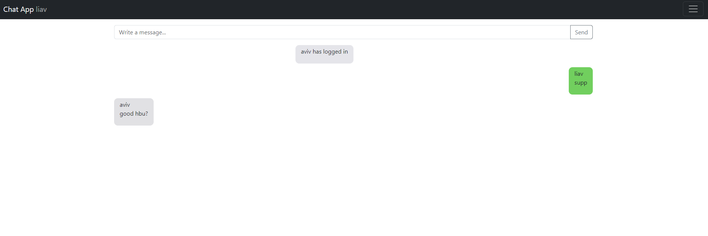

# flask-socketio-chat

Real-time chat application built with Flask, Socket.IO, and vanilla JavaScript for seamless communication between users
+---------------------+
| Web Browser |
| (Vanilla JS App) |
+---------------------+
|
| WebSocket Connection
|
+---------------------+
| Flask Server |
| (Python Backend) |
+---------------------+
|
| HTTP Requests (GET, POST)
|
+---------------------+
| Client-side |
| HTML Templates |
| (Jinja2) |
+---------------------+

